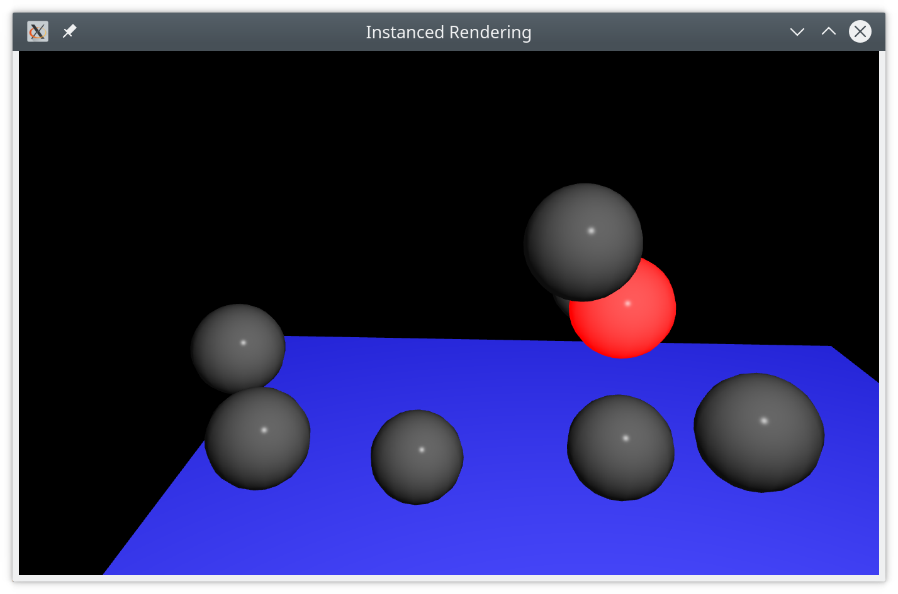

# Qt3D Experiments

Here are few projects that make use of Qt3D framework - I have ended up creating them while working on rendering techniques for QGIS 3D.

Qt3D framework is a really nice addition to Qt ecosystem, but the documentation is still quite sparse and sometimes even wrong. There are not that many code examples floating around that use Qt 3D to demonstrate various 3D rendering techniques, so this is my little contribution towards that.

I have used QML as much as possible to keep the code concise. C++ was only used for bits where QML does not have the necessary bindings (yet?).

## Compiling on Ubuntu

If you are using Ubuntu 18.04 or 20.10, then everything is great and the `qt3d5-dev` package contains all include files you need. But if you are on Ubuntu 18.10, 19.04, 19.10 or 20.04, that package does not contain include files for Qt3DExtras and Qt3DQuickExtras libraries. A workaround is to:

1. download source package for your system version - e.g. from here for 20.04: https://packages.ubuntu.com/source/focal/qt3d-opensource-src and unpack it
2. add to qmake `.pro` file a line to path to those missing includes, e.g. `INCLUDEPATH += /your/path/qt3d-everywhere-src-5.12.8/include`

# Billboards

Demonstrates billboards rendering technique - quads with constant screen size that are always facing the camera. This uses geometry shader to generate quads from points.

# Edge Detection

Edge detection is done as a post-processing pass of scene rendering. In the first stage we generate depth texture and normal vectors texture which are then combined in the post-processing pass using Sobel filter.

# Instanced Rendering

Using instancing to render a single geometry at multiple different positions.

# Lines

Rendering of lines in 3D space with constant screen space thickness. Supports flat and miter joins.

# Arrows

Drawing rotated and scaled textures of arrows on a mesh. (The end goal is that arrow angles/magnitudes of arrows would be read from another texture, not just based on world positions.)

